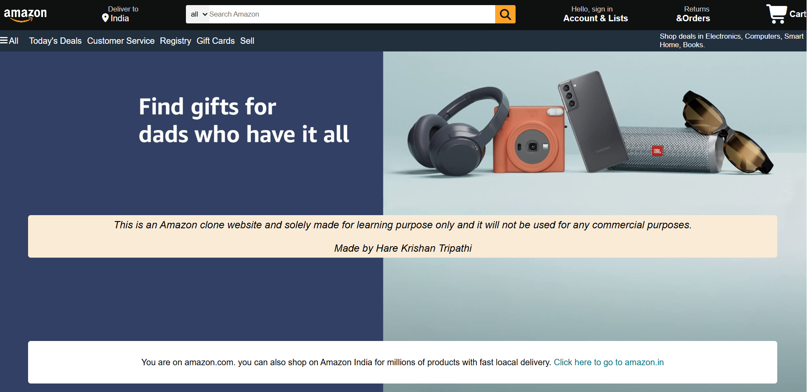

# Amazon Clone

A simple front-end clone of the Amazon homepage, made using just **HTML and CSS**.

This is one of my first web dev projects — I built it to practice recreating a real website layout from scratch.

> This is just a learning project. Not affiliated with Amazon and not for commercial use.

---

## Preview




---

## What's included

- Navbar with logo, search bar, sign-in, and cart
- A hero banner section
- Category cards (Electronics, Fashion, Furniture, etc.)
- A footer

---

## Built with

- HTML
- CSS
- Font Awesome (for icons)

---

## How to run it

1. Clone the repo
   ```bash
   git clone https://github.com/Ankur1445/Project-Amazon-Clone.git
   ```
2. Open `index.html` in your browser

That's it, no setup needed.

---

## What I'm still learning / improving

- Making it responsive for mobile
- Adding real links
- Using `` tags instead of background-images

---

## About

Made by **[Hare Krishan Tripathi]** while learning web development.